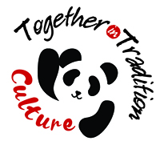
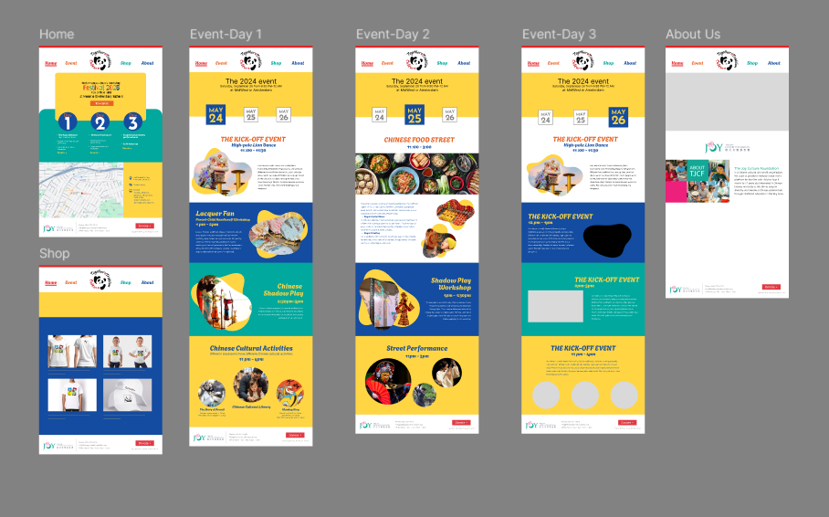
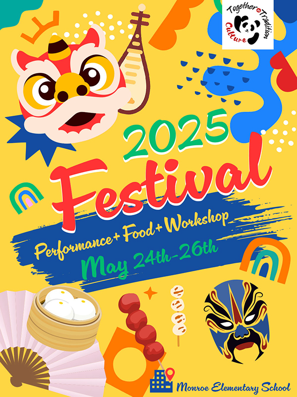
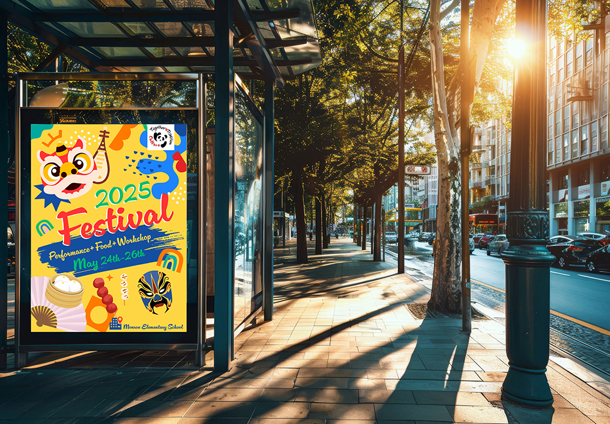

# DES 228 project 3: together in tradition festival

Create by Ling Zhou 

Hosted currently at <https://github.com/Ling-cri/projectThreeFestival.git>

####November 20,2024

## project overview

Together in Tradition is an event website that introduces a festival celebration event promoting traditional Chinese culture held at the Asian/Pacific American Heritage Month. 

This event lasts for three days and is held on the elementary school campus, mainly targeting the families of students in the school and people in the nearby community. 

The event aims to make Chinese American children proud of Chinese culture and to provide other ethnic families in the school and nearby neighborhood with a better understanding of Chinese culture.

## technical statement

The photographs on the detail pages are all generated by AI

The programming languages used include HTML and CSS. Using the software Visual Studio Code, and the hosting platform is GitHub.

## figma wireframes

## prototype 

**[view prototype](https://www.figma.com/proto/XxbJMcVAKb0W2q5052zyVf/Draft?node-id=1-2&node-type=canvas&t=vZmluFesvL3jXTLl-0&scaling=scale-down&content-scaling=fixed&page-id=0%3A1&starting-point-node-id=1%3A2)**

## fonts

* Cinema Script designed by Dave Rowland.
https://fonts.adobe.com/fonts/cinema-script

* Edu SA Beginner designed by Tina Anderson, Corey Anderson
https://fonts.google.com/specimen/Edu+SA+Beginner?query=Edu+SA+Beginner+

## Physical Asset

## acknowledgment

Thanks to Professor Joshua Wilder Oakley for his guidance and help throughout the semester.